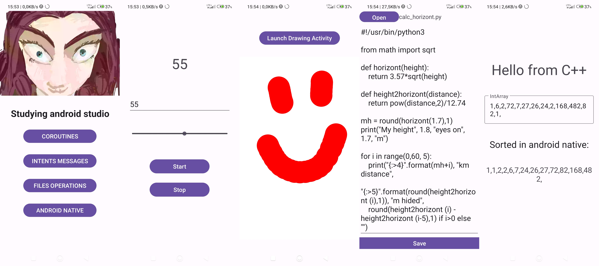

# Android studio study
Simple Android Studio project to study the IDE and its features. Its main focus is to test out:
- coroutines functionality,
- intent handling,
- file handling,
- android native,
- a little of UI workflow.

## Screenshots
