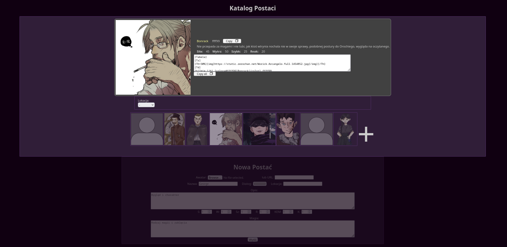

# Characters catalog (PHP MVC)

A simple PHP web application created for educational purposed and for cataloging my original characters.

## Key points
- Clean and simple MVC (Model View Controller) structure
- Apache2 mod_rewrite for handling request redirection and hiding everything outside public directory
- Local custom database for just a little of data
- Functional use case with possibilities to store, browse, check details and add characters by using web interface only

## Project Structure
```
Characters catalog (PHP MVC)/
├── app/                # MVC structured app
│   ├── controllers/    # Controllers are determined by 1st part of url
│   ├── core/           # MVC structure comes from there
│   ├── images/         # Images stored by local database
│   ├── models/         # Models for easy database control
│   ├── mydb/           # Local database text data saved in json files
│   ├── views/          # Views containing HTML with PHP
│   ├── dbconfig.php    # Local database core interface
│   └── init.php        # MVC initialization point
├── public/
│   ├── index.php       # Entry point, it calls app/init.php
│   ├── style.css       # Global styles
│   └── index.js        # Global scripts
├── .htaccess           # Redirection rules for Apache
├── index.php           # Page for testing, not accessible by end user
└── README.md           # This file
```

## Screenshot
