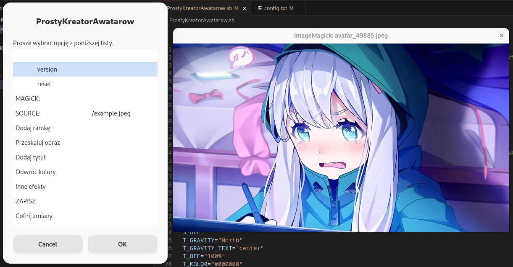

# Prosty Kreator Awatarów (Simple avatar creator)

Simple application for editing images using ImageMagick. Works both in console mode and in window mode. It has a bunch of builtin image transformations. It is aiming to add effects to image to make them nice avatars (I don't recommend though XD). Mainly creating for educational purpose.

## Key features
- Single transformation can be used by console version of this app
- Zenity is used for window mode
- Help and version options
- Can be used with both magick in $PATH or by providing path to it (then app stores that in config.txt file)
- Preview after each transformation in windowed mode

## How to use
### Window mode (zenity)
```
chmod ./ProstyKreatorAwatarow.sh u+x
./ProstyKreatorAwatarow.sh
```
### Console mode
Check `./ProstyKreatorAwatarow.sh -h` or `./ProstyKreatorAwatarow.sh --help` option.

## Screenshots

### After some transformations
